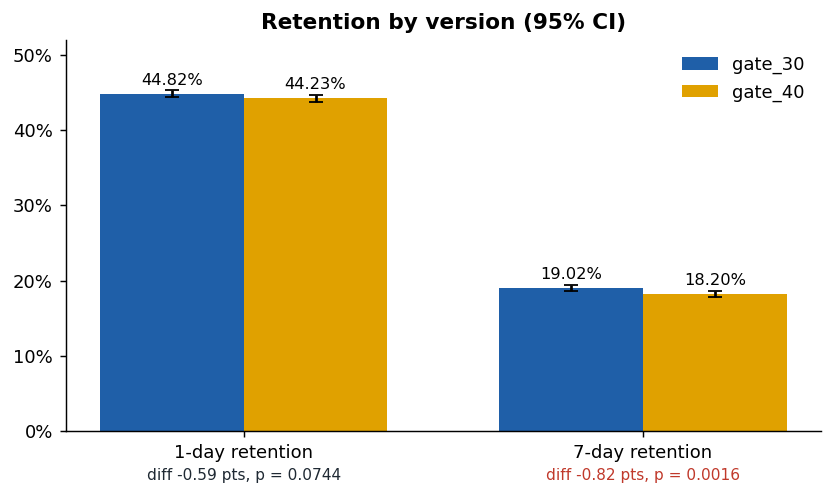
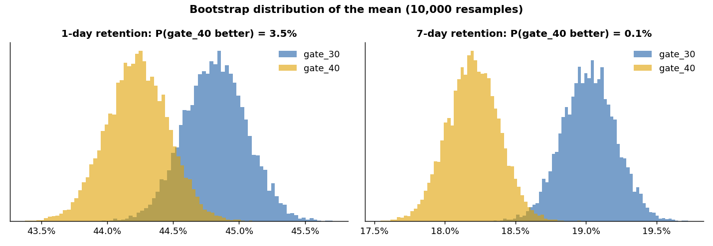
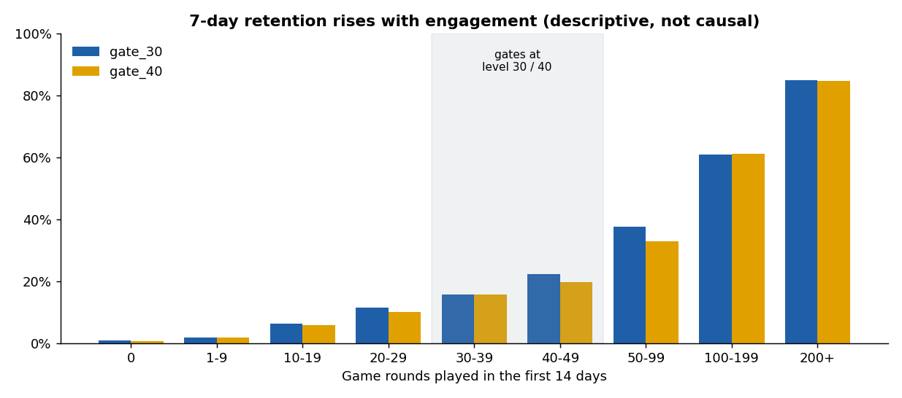
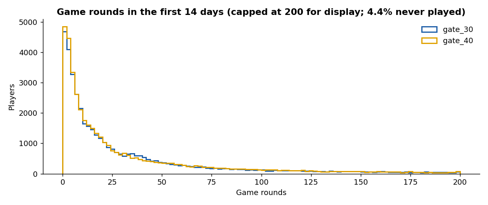

# Mobile Game A/B Test: Cookie Cats Gate 30 vs Gate 40

In the mobile puzzle game *Cookie Cats*, players hit a "gate" where they must wait or pay to keep
playing. The game moved the first gate from **level 30 to level 40** for a random half of
**90,189 new players**. Did that change player retention, and should the change ship?

**Tools:** Python (pandas, NumPy, SciPy, matplotlib). **Methods:** sample-ratio-mismatch check,
two-proportion z-tests, bootstrapped confidence intervals, minimum detectable effect,
Mann-Whitney U test.



## Results

| Metric | gate_30 (control) | gate_40 (test) | Difference | p-value | Bootstrap 95% CI | P(gate_40 better) |
|---|---|---|---|---|---|---|
| 1-day retention | 44.82% | 44.23% | -0.59 pts (-1.3%) | 0.074 | -1.25 to +0.06 pts | 3.5% |
| **7-day retention** | **19.02%** | **18.20%** | **-0.82 pts (-4.3%)** | **0.0016** | **-1.34 to -0.31 pts** | **0.1%** |

**Recommendation: don't ship. Keep the gate at level 30.**

* **7-day retention fell 0.82 points with the gate at level 40** (19.02% to 18.20%, a 4.3% relative drop).
  The difference is statistically significant (z = -3.16, p = 0.0016), the bootstrap 95% interval is entirely
  below zero, and in 99.9% of 10,000 bootstrap resamples gate 30 kept more players.
* **1-day retention also dipped** (-0.59 points), but that difference is not significant (p = 0.074). That
  makes sense: few players reach level 30 on day one, so the gate mostly matters later.
* **The test had enough power for this effect.** With ~45K players per group, the smallest 7-day difference the
  test could reliably detect (80% power) was 0.73 points, and the observed effect (0.82) is above it.
* **Engagement was about the same.** After removing one outlier (49,854 rounds in 14 days), median rounds were
  17 vs 16 (Mann-Whitney p = 0.051). 4.4% of players installed but never played a round.
* **One likely explanation:** an earlier gate forces a break, and that pause may keep the game enjoyable
  for longer (hedonic adaptation). The data can't prove why, but the retention result is clear.



### Caveat: sample ratio mismatch

The split was 44,700 vs 45,489 (49.6% / 50.4%). A chi-square test against a 50/50 split gives
**p = 0.0086**, which flags a possible assignment or logging issue. The imbalance is small (under 1 point)
and both tests point the same way, but in a real company I would check the randomization and event logging
with the engineering team before treating the result as final.

### Descriptive views

7-day retention rises steeply with how much someone plays. Gate 40 players retain less in the 40-99 rounds
bands, around where the two gates sit. This view is *descriptive only*: rounds played happen after
assignment and are affected by the gate, so splitting by them is not a fair causal comparison. For the same
reason, comparing only players with 30+ rounds (43.88% vs 43.00%, p = 0.108) is exploratory.





## How it works

1. **Load and check** (`abtest/analysis.py`): duplicate player IDs, unknown version labels, missing values,
   negative rounds, invalid retention flags. Handles both `TRUE/FALSE` and `True/False` spellings.
2. **Sample ratio check**: chi-square goodness-of-fit against a 50/50 split.
3. **Retention tests** (`abtest/stats.py`): two-proportion z-test with a pooled standard error, Wald 95% CI,
   10,000-resample bootstrap (binomial resampling, which is exactly equivalent to resampling players for a
   0/1 metric), probability that the test group is better, and the minimum detectable effect at 80% power.
4. **Engagement**: medians and a Mann-Whitney U test (rounds are very skewed), with the outlier removed.
5. **Outputs**: `outputs/results.json`, `outputs/summary_table.csv`, `outputs/retention_by_rounds.csv`,
   `outputs/quality_checks.csv`, and charts in `docs/`.

## Run it

1. Download `cookie_cats.csv` from Kaggle:
   [Mobile Games A/B Testing - Cookie Cats](https://www.kaggle.com/datasets/yufengsui/mobile-games-ab-testing)
   and put it in `data/raw/`.
2. Then:

```bash
pip install -r requirements.txt
python -m abtest               # checks, tests, outputs/
python scripts/make_charts.py  # README charts -> docs/
pytest                         # 11 tests
```

## Project structure

```
abtest/
  stats.py       SRM check, z-test, bootstrap, Mann-Whitney, MDE
  analysis.py    load, quality checks, full analysis, summary table
  __main__.py    command line
scripts/         make_charts.py
outputs/         results, summary table, checks
docs/            charts used in this README
tests/           pytest suite (runs on small synthetic data)
```

## Data source

*Mobile Games A/B Testing - Cookie Cats*, Kaggle (originally from the DataCamp project of the same
name; game by Tactile Games). One row per player: `userid`, `version` (gate_30 / gate_40),
`sum_gamerounds` (rounds in the first 14 days), `retention_1`, `retention_7`.

## License

MIT (code).
